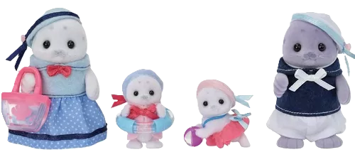
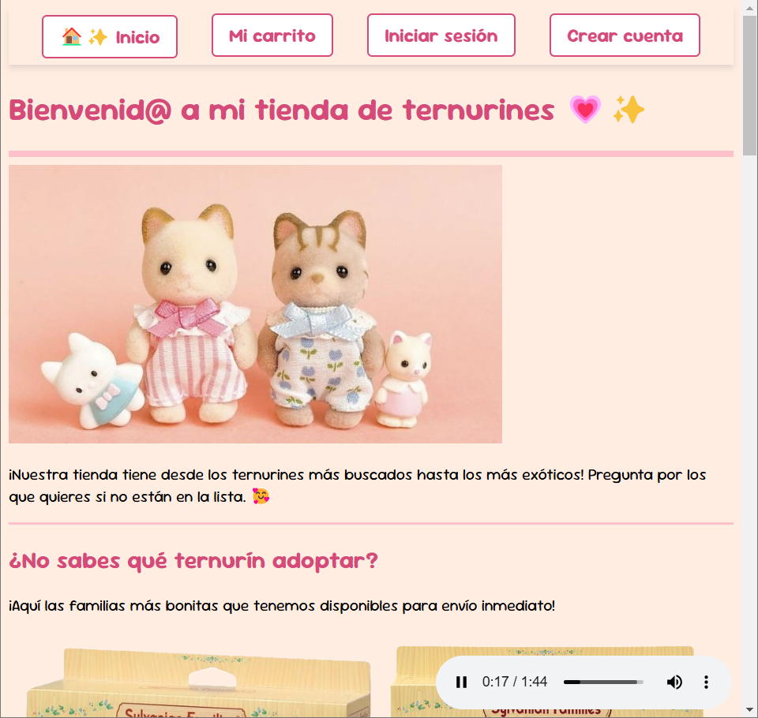

# Tienda de ternurines 💗✨

En esta página web puedes adquirir adorables familias de ternurines o ternurines individuales.

Accede a la página a través del siguiente enlace: https://jimenagv.github.io/tienda-de-ternurines/



***
***
*Sitio creado como proyecto final del módulo "Introducción a la programación" del curso de Frontend de DEV.F.*

### Características
* Utiliza HTML con CSS integrado en el mismo archivo.
* Contiene:
  * Navegación interactiva.
  * Formulario de registro para nuevos usuarios (sin registro ni envío de datos).
  * Página base de carrito de compras y de inicio de sesión.

#### Ejemplo: Página principal


### ¿Quieres desplegar el proyecto localmente?
Sigue los siguientes pasos:
1. Clona este repositorio:  
   ```bash
   git clone https://github.com/jimenagv/tienda-de-ternurines.git
2. Navega al directorio del proyecto:
   ```bash
   cd tienda-de-ternurines
3. Abre el archivo *index.html* en el navegador.

### Autor
**Creado por:**
Jimena García

Estudiante